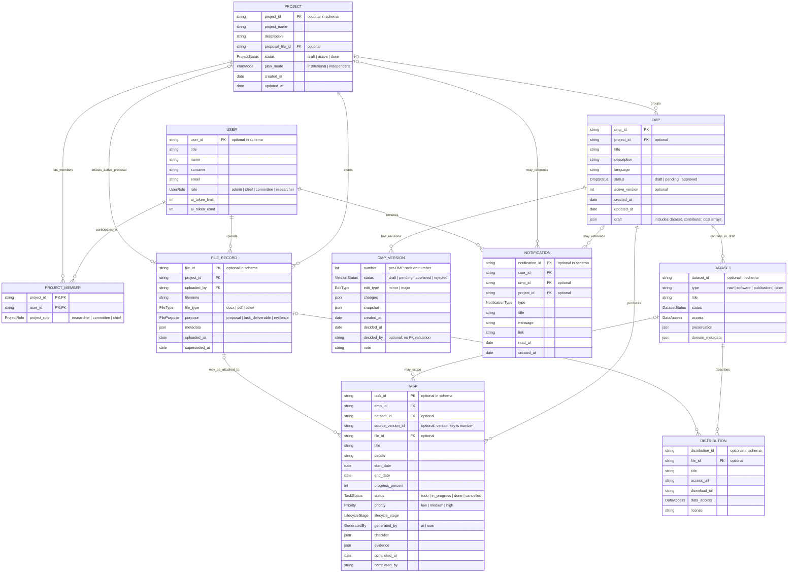

# Frontend data model ERD

This diagram reflects the current Zod schemas and client-side stores. It is a
logical view of the frontend model, not a claim that these are database tables
or that the indicated references are enforced by a database.

`DATASET`, its `DISTRIBUTION`s, contributors, and costs are nested values in
the DMP draft, not independent records in the current client model. Likewise,
`DMP_VERSION` describes entries in `DmpRecord.versions`, embedded in each DMP
record. The ERD draws these nested structures separately to make their
relationships legible.

## Review of the proposed ERD

- **DMP cardinality:** the code allows a DMP to have no `project_id`, and one
  project can have multiple DMPs. The proposed mandatory one-to-one relationship
  does not match the schemas or seeded data.
- **Project fields:** the current schema includes `plan_mode`; the proposed
  diagram omitted it. `ProjectStatus` is `draft | active | done`.
- **DMP fields:** `DmpForm` carries `alternate_identifier`, begin/end dates,
  ethical and indigenous information, contributor/cost/dataset arrays, and
  `schema_version`. Several proposed fields are not in the schema (for example
  `current_version`, `generated_by`, `contact`, DMP-level `access` and
  protection-classification fields). In the saved client record, the active
  revision is `active_version`, and status/timestamps plus summary fields are
  held by `DmpRecord`.
- **Versions and approvals:** versions exist as nested `PlanVersion` values;
  there is no separate `version_id`, `APPROVAL` entity, reviewer ID, or approval
  comment. Review outcome is recorded on the version with `status`, optional
  `decided_at`, `decided_by`, and `note`. The `decided_by` string is not
  schema-validated as a user reference.
- **Tasks and files:** tasks include cancelled status, priority, lifecycle
  stage, checklist, evidence, completion fields, and optional dataset/file
  references. File purpose includes `task_deliverable` and `evidence`. An
  optional task `file_id` may point to a file, but evidence references are
  polymorphic strings (file, URL, or DOI) rather than guaranteed file FKs.
- **Notifications:** the actual type values are `dmp_submitted`,
  `dmp_approved`, `dmp_finalized`, `tasks_generated`, and
  `proposal_superseded`. A notification has title/message/link, optional DMP
  and project IDs, and optional `read_at`; it does not have the proposed
  generic `related_entity` or `is_read` fields.
- **AI generation:** there is no `AI_GENERATION` record with inputs, outputs,
  or token totals. AI activity is represented in a separate persisted thread
  store as user/assistant turns and lightweight events, scoped by DMP ID when
  available (or stored as unscoped activity). Its actions are
  `analyze_proposal`, `regenerate_field`, `batch_regenerate`, `generate_tasks`,
  and `redraft_steps`.
- **IDs and constraints:** many input-schema IDs are optional, and references
  are plain strings rather than validated foreign keys. `PROJECT_MEMBER` has no
  schema-level uniqueness check for `(project_id, user_id)`. Treat the PK/FK
  labels here as logical relational recommendations, not enforced constraints.
